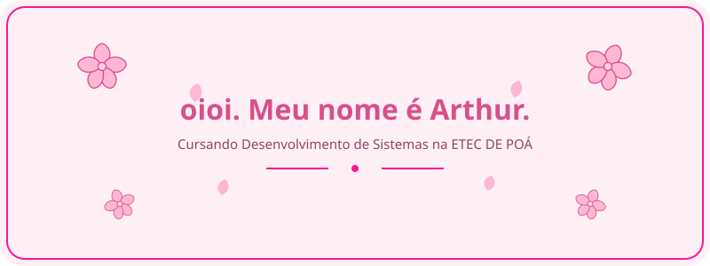
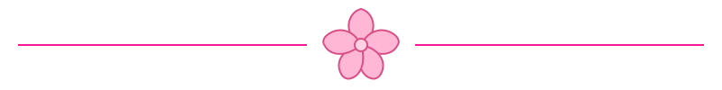

### 🌷 Eu:

Gosto de jogos (e desenvolver). 🎮  
Adoro escrever. ✍️  
Gosto bastante de coisa nova e esquisita.   
Tô praticando várias coisas, principalmente de lógica. 
Sei um monte de coisa. HTML, CSS, JavaScript, SQL, até GML, do GameMaker. 💻 
Tenho tempo livre e amo colocar ideia ruim pra prática. 🌸

### Coisas que eu to aprendendo:

#### Desenvolvimento Web (O básico.)

#### Banco de Dados (Acho legal até certo ponto.)

#### Game Development (Quando eu me formar nisso aqui...)

###  ⭐Meus filhos preferidos.

#### EvaWiki

Uma wiki do anime Neon Genesis Evangelion. Tem bastante informação sobre o universo e presta de porta de entrada pro mesmo.

**HTML • CSS**

[O site](https://eva-wiki.vercel.app)

#### 🦴 O Resumo da Pré-História

Esse aqui foi feito pro evento de portas abertas da escola. Casa Aberta, de 2025. É um resumo sobre todas as invenções descobertas na pré história.
Neal.Fun é a maior inspiração.

**HTML • CSS • JavaScript**

[Conhecer](https://o-resumo-da-pre-historia.vercel.app)

####  ⭐PixelHub⭐

O Pixel Hub é basicamente uma desculpa pra programar um site que envolvesse criação de torneios. É meu bebê.
Simula algumas coisas, como a criação de contas. Toma cuidado, hein!

**HTML • CSS • JavaScript**

[Criar Torneios](https://pixel-hub-puce.vercel.app)

### Atualmente, to aprendendo:

🟨 JavaScript  
🟩 Node.js  
🗄️ Banco de dados  
🎮 GameMaker e GML   
🌐 Desenvolvimento Web

### 🌷 Onde me acha?

### Até mais.

